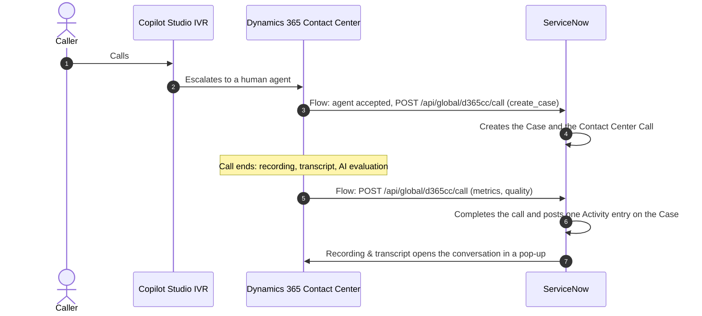
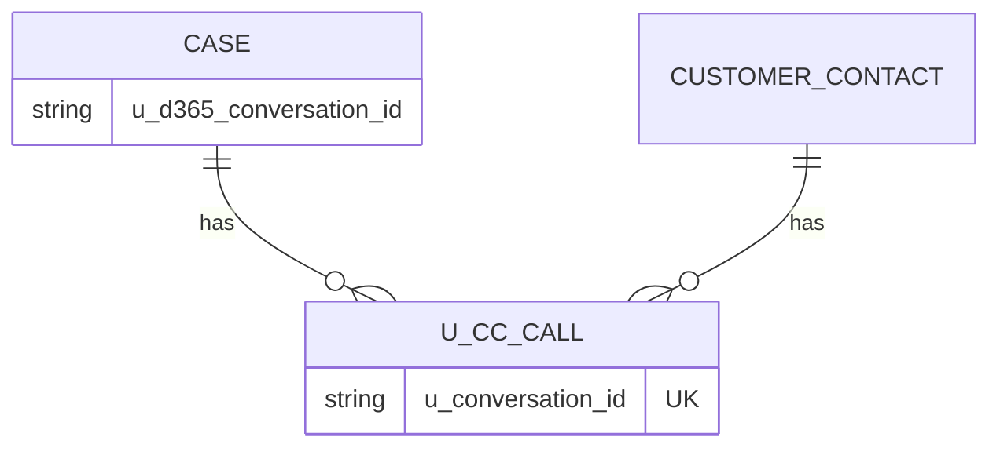

# Dynamics 365 Contact Center × ServiceNow — Call Journey

**Your agents work in ServiceNow. Your calls run on Dynamics 365 Contact Center.**
Every phone call lands on the ServiceNow Case with its full story, and one click opens the Dynamics 365 recording, transcript and AI quality evaluation **inside ServiceNow**.

This is the ServiceNow port of the [Salesforce Call Journey](https://github.com/moliveirapinto/d365-contact-center-salesforce-call-journey). Built and tested on the **CSM/FSM Configurable Workspace** (Zurich).

### 1. The Case: one **Open call journey** button, and a log entry for every call


### 2. The Contact Center Call record: the call journey on top, one **Recording & transcript** button


### 3. Recording & transcript: the Dynamics 365 conversation, full size, inside ServiceNow


---

> **Download the install packages from the [latest release](https://github.com/moliveirapinto/d365-contact-center-servicenow-call-journey/releases/latest)** (ServiceNow update set + Dynamics 365 solution), then follow [Install, step by step](#install-step-by-step).

---

## Contents

1. [What you get](#what-you-get)
2. [What is in this repository](#what-is-in-this-repository)
3. [Before you start](#before-you-start)
4. [Install, step by step](#install-step-by-step)
   * [Step 1 – ServiceNow: import the update set](#step-1--servicenow-import-the-update-set)
   * [Step 2 – ServiceNow: run the post-install script](#step-2--servicenow-run-the-post-install-script)
   * [Step 3 – ServiceNow: create the integration user](#step-3--servicenow-create-the-integration-user)
   * [Step 4 – Dynamics 365: import the solution](#step-4--dynamics-365-import-the-solution)
   * [Step 5 – Dynamics 365: connect and turn the flows on](#step-5--dynamics-365-connect-and-turn-the-flows-on)
   * [Step 6 – Softphone in the ServiceNow Workspace](#step-6--softphone-in-the-servicenow-workspace)
   * [Step 7 – Copilot Studio (optional)](#step-7--copilot-studio-optional)
5. [Test it](#test-it)
6. [Troubleshooting](#troubleshooting)
7. [Alternative: scripted install](#alternative-scripted-install)
8. [How it works](#how-it-works)
9. [Data model](#data-model)
10. [Settings](#settings)
11. [Uninstall](#uninstall)
12. [Notes and limits](#notes-and-limits)

---

## What you get

| Where | What the agent sees |
|---|---|
| **Case header** | One button, **Open call journey**. One call on the Case: it opens that call as a sub tab. Several calls: a **Calls on this case** pop-up lists them (date, time, direction, agent, duration, sentiment, quality score, status) and the one you pick opens as a sub tab. |
| **Case Activity stream** | **One entry per call**, posted when the call completes: *Contact Center call completed* with total and talk time, agent, sentiment and the AI quality score, plus an **Open call journey** link. |
| **Contact Center Call record** | The **Call Journey** card on top (received → virtual agent → queue → agent → ended, with duration, talk time, sentiment and caller), then the call fields. One **Recording & transcript** button in the header. |
| **Recording & transcript** | A large pop-up with the Dynamics 365 conversation: audio player and waveform, transcript, call metrics, quality trendline and the AI evaluation side pane. |
| **Workspace top bar** | The Dynamics 365 Contact Center conversation widget (softphone), through ServiceNow OpenFrame. |
| **Classic UI** | A *Contact Center Calls* related list on the Case and on the Customer Contact. |

Calls reach ServiceNow by themselves: when an agent accepts a voice call in Dynamics 365 a **Case and a call record are created**, and when the call ends the **metrics and the AI quality evaluation** are added.

## What is in this repository

| Folder / file | What it is |
|---|---|
| [`servicenow/package/D365_ContactCenter_CallJourney_ServiceNow_UpdateSet_1.0.0.xml`](servicenow/package) | **ServiceNow update set**: table `u_cc_call`, Case fields, Script Includes, Business Rules, UI Page and Actions, REST API, system properties and the post-install Fix Script. |
| [`servicenow/package/post-install-fix-script.js`](servicenow/package/post-install-fix-script.js) | Readable copy of the Fix Script that is already inside the update set. |
| [`dynamics365/D365ContactCenter_ServiceNow_CallJourney_1_0_0_0.zip`](dynamics365) | **Dynamics 365 solution** (unmanaged): the two Power Automate flows, a connection reference and three environment variables for the ServiceNow address and login. No credentials inside. |
| `servicenow/src/`, `deploy/` | Source of everything above and a scripted installer (see [Alternative: scripted install](#alternative-scripted-install)). |
| `docs/images/` | Screenshots used in this README. |

## Before you start

You need:

* A **ServiceNow instance with Customer Service Management** (CSM) and the **CSM/FSM Configurable Workspace**. You must be able to sign in as `admin` (or a user with the `admin` role).
* A **Dynamics 365 Contact Center** environment with voice, and permission to import solutions and run Power Automate flows there.
* The **same Microsoft Entra account** signed in to Dynamics 365 in the agent's browser. The recording pop-up shows Dynamics 365 inside ServiceNow, so the agent must be able to sign in to Dynamics 365 from that browser (allow third-party cookies for `*.dynamics.com` if your browser blocks them).
* These two values, which you will use several times:

  | Value | Example |
  |---|---|
  | ServiceNow instance host name | `dev12345.service-now.com` |
  | Dynamics 365 environment URL | `https://contoso.crm.dynamics.com` |

> **Try it on a non-production instance first.** This is a community sample, not an official Microsoft or ServiceNow product.

---

## Install, step by step

### Step 1 – ServiceNow: import the update set

1. Download [`D365_ContactCenter_CallJourney_ServiceNow_UpdateSet_1.0.0.xml`](servicenow/package/D365_ContactCenter_CallJourney_ServiceNow_UpdateSet_1.0.0.xml) (use the **Download raw file** button on GitHub).
2. In ServiceNow open **System Update Sets → Retrieved Update Sets** and click **Import Update Set from XML**.
3. Choose the file and click **Upload**. The update set **D365 Contact Center - Call Journey 1.0.0** appears with state *Loaded*.
4. Open it and click **Preview Update Set**. Wait until the state is *Previewed*. There should be **0 problems**.
5. Click **Commit Update Set**.

### Step 2 – ServiceNow: run the post-install script

The update set cannot carry form layouts, related lists and the softphone reliably, so a Fix Script does it. It is safe to run any number of times.

1. In **System Properties** (type `sys_properties.list` in the navigator) set:

   | Property | Value |
   |---|---|
   | `d365cc.org_url` | Your Dynamics 365 URL, for example `https://contoso.crm.dynamics.com` |
   | `d365cc.app_id` | *(optional)* The id of the Contact Center app in your environment |
   | `d365cc.time_zone` | IANA time zone used in call titles, for example `America/New_York` |
   | `d365cc.time_zone_label` | Short label shown in call titles, for example `ET` |

2. Open **System Definition → Fix Scripts**, open **D365CC - Post-install configuration** and click **Run Fix Script**.
3. The output lists what it did: form layouts in place, related lists added, softphone configured. If it says `ACTION NEEDED: set system property d365cc.org_url`, go back to step 1 and run it again.

### Step 3 – ServiceNow: create the integration user

Dynamics 365 uses this user to send calls to ServiceNow.

1. **User Administration → Users → New**. User ID `d365cc.integration`, tick **Web service access only**.
2. Give it the role **`sn_customerservice_agent`**.
3. **Set the password inside ServiceNow** (the *Set Password* UI action or a background script). Do not set it through the Table API: that stores it in clear text and sign-in then fails.
4. Keep the user ID and password: you need them in step 5.

### Step 4 – Dynamics 365: import the solution

1. Go to <https://make.powerapps.com>, pick your **Dynamics 365 Contact Center environment**, then **Solutions → Import solution**.
2. Choose [`D365ContactCenter_ServiceNow_CallJourney_1_0_0_0.zip`](dynamics365/D365ContactCenter_ServiceNow_CallJourney_1_0_0_0.zip) and click **Next**.
3. On the connections page, **create or choose a Microsoft Dataverse connection** for *D365 Contact Center - Dataverse*, and fill the three environment variables:

   | Variable | Value |
   |---|---|
   | **ServiceNow Instance** | Host name only, for example `dev12345.service-now.com` |
   | **ServiceNow User** | `d365cc.integration` (the user from step 3) |
   | **ServiceNow Password** | The password of that user |

4. Click **Import** and wait for the *success* message.

The solution contains two flows:

| Flow | Does |
|---|---|
| **D365 Contact Center - Create ServiceNow case when an agent accepts a call** | Every minute, finds voice calls an agent has accepted and sends them to ServiceNow, which creates the **Case and the call record** (it looks up the customer by phone, e-mail or name, or creates one). |
| **D365 Contact Center - Sync ended calls to ServiceNow** | When a voice conversation ends, sends the **timings, sentiment and AI quality evaluation** to ServiceNow. |

> The password is stored as a plain environment variable. For production move it to **Azure Key Vault** (a secret environment variable).

### Step 5 – Dynamics 365: connect and turn the flows on

1. In **Solutions → D365 Contact Center - ServiceNow Call Journey** open **Connection references**, open *D365 Contact Center - Dataverse* and select your connection if it is not set.
2. Open each of the two flows and click **Turn on**. A flow that is off, or has no connection, does nothing.
3. The account that owns the connection must be able to **read voice conversations, contacts and evaluation history** in the environment.

### Step 6 – Softphone in the ServiceNow Workspace

The Fix Script in step 2 created the OpenFrame configuration **Dynamics 365 Contact Center** and gave it to you. For every other agent:

1. Give the role **`sn_openframe_user`**.
2. *(Optional)* In the Copilot Service admin center → *your default contact center* → **Conversation widget**, copy the **Embeddable conversation widget URL** and paste it in **OpenFrame → Configurations → Dynamics 365 Contact Center → URL**. The default URL is built from `d365cc.org_url`.

The softphone icon then appears in the top bar of the Workspace.

### Step 7 – Copilot Studio (optional)

If your IVR runs in Copilot Studio and creates the Case itself, write the conversation id into the ServiceNow Case so the call is linked instead of duplicated:

* Use the ServiceNow connector → **Create record** on table `sn_customerservice_case`.
* Map the field **`u_d365_conversation_id`** to `Global.msdyn_ConversationId`.

If you skip this, the accept flow creates the Case for you.

---

## Test it

1. Place a call to your Dynamics 365 voice number and let an agent accept it, then end the call.
2. Within about a minute of the agent accepting, a **Case** appears in ServiceNow with a **Contact Center Call** related to it.
3. When the call ends, the Case **Activity** shows **Contact Center call completed**.
4. On the Case click **Open call journey**: the call opens as a sub tab with the Call Journey card on top.
5. On the call click **Recording & transcript**: the Dynamics 365 recording, transcript and evaluation open in a full-size pop-up.

To send a past call again without placing a new one, use the [replay script](#alternative-scripted-install) (`deploy/d365/replay-sync.mjs`).

## Troubleshooting

| Symptom | Cause and fix |
|---|---|
| Nothing arrives in ServiceNow | Check that **both flows are on** and their connection is set. Open the flow's **Run history** in Power Automate. |
| Flow run fails with **401** | The integration user's password was set through the Table API, or the environment variables are wrong. Set the password again inside ServiceNow and re-check the three variables. |
| Flow run fails with **403** | The integration user lacks the role `sn_customerservice_agent`. |
| No **Open call journey** button on the Case | Reload the Workspace (hard refresh). The button shows on Cases in the CSM/FSM Configurable Workspace. |
| Click **Open call journey** and nothing opens | The call record was deleted, or the Workspace tab was reloaded just before. Reload the Case and try again. |
| The Activity link opens a tab that closes by itself | By design: ServiceNow does not let the Activity stream run scripts, so a short hand-off page asks the Workspace to open the call as a sub tab. The **Open call journey** button on the Case does not do this. |
| **Recording & transcript** pop-up stays blank or asks to sign in | Sign in to Dynamics 365 in the same browser, and allow third-party cookies for `*.dynamics.com`. Check `d365cc.org_url` has no trailing text. |
| No softphone icon | The user needs the role `sn_openframe_user`; check **OpenFrame → Configurations** and that `d365cc.org_url` is set, then run the Fix Script again. |
| Call journey card or form looks empty | Run the Fix Script again (step 2). |
| Dynamics 365 widget keeps crashing in the browser | Very large numbers of unread notifications in Dynamics 365 can exhaust the browser: delete old `appnotification` records. |

## Alternative: scripted install

If you prefer scripts to the packages (or want to change the code), requires **Node 18+**:

```powershell
copy .env.example .env.local     # fill in your instance, admin login and Dynamics 365 URL
node deploy/deploy.mjs           # schema, logic, UI, softphone, REST API, open-call hand-off
```

| Step | Script | Does |
|---|---|---|
| 1 | `deploy/steps/01-schema.mjs` | Table, columns, choices, Case fields, `d365cc.*` settings |
| 2 | `deploy/steps/02-logic.mjs` | Script Includes, Business Rules, calculated fields |
| 3 | `deploy/steps/03-ui.mjs` | UI Page, UI Actions, form layouts (classic + Workspace) |
| 4 | `deploy/steps/04-security.mjs` | OpenFrame (Dynamics 365 widget) |
| 5 | `deploy/steps/05-rest.mjs` | Scripted REST API for the Dynamics 365 flows |
| 6 | `deploy/steps/06-play.mjs` | Call picker and the Case button |
| 7 | `deploy/steps/07-open.mjs` | Open-call hand-off for the Activity link |

All steps are idempotent. Run a subset with `node deploy/deploy.mjs 03-ui`.

Dynamics 365 flows from scripts (needs a Dataverse token in `D365_TOKEN` and the integration password in `SN_INTEGRATION_PASS`):

```powershell
node deploy/d365/create-accept-flow.mjs     # create the Case when an agent accepts
node deploy/d365/create-flow.mjs            # sync metrics when the call ends
node deploy/d365/replay-sync.mjs <conversationId>   # replay one past call
```

## How it works



The REST call is an **upsert** keyed on the Dynamics 365 conversation id, so it does not matter which event arrives first: you always end up with exactly one call record per call.

### Feature parity with the Salesforce version

| Salesforce | ServiceNow (this repo) |
|---|---|
| `Contact_Center_Call__c` object | Table **`u_cc_call`** ("Contact Center Call"), same fields |
| Case fields `D365_Conversation_Id__c`, `D365_Call_Recording__c` | `sn_customerservice_case.u_d365_conversation_id`, `u_d365_call_recording`, `u_call_journey` |
| Custom Setting *D365 Contact Center Settings* | System properties `d365cc.*` |
| Flow *Create Call from IVR case* | Business Rule **D365CC – Create call from IVR case** |
| `callTimeline` LWC | Script Include **`D365CCJourney`**, rendered in the Call Journey field |
| `callRecordingModal` LWC | UI Page **`d365cc_recording`** + UI Action **Recording & transcript** |
| D365 sync flow → Salesforce REST | Scripted REST **`POST /api/global/d365cc/call`** + the two Power Automate flows |
| D365 CTI widget in the Salesforce console | **OpenFrame** configuration |

## Data model

One **Case** has many **calls**. Each call is its own row in `u_cc_call`, related to the Case (`u_case`) and the customer (`u_contact`).



* `u_conversation_id` is unique per call and is the key the flows upsert on.
* `sn_customerservice_case.u_d365_conversation_id` holds the conversation the IVR stamped on the Case; further calls link to the Case by being related to it.
* The AI quality evaluation (score, plan, summary, coaching, details) is stored on the call. The score and band show on the Case Activity entry and in the call picker; the full evaluation is in the Dynamics 365 pop-up.

## Settings

| Property | Meaning |
|---|---|
| `d365cc.org_url` | Dynamics 365 environment URL |
| `d365cc.app_id` | Contact Center app id (optional) |
| `d365cc.time_zone` | IANA time zone used in call titles |
| `d365cc.time_zone_label` | Short label in call titles (for example `ET`) |

Times inside the Call Journey card and the call picker are shown in each agent's own ServiceNow time zone.

## Uninstall

* **Dynamics 365:** turn the two flows off and delete the solution *D365 Contact Center - ServiceNow Call Journey*.
* **ServiceNow:** deactivate the Business Rules *D365CC – …*, the OpenFrame configuration and the Scripted REST API *D365 Contact Center*. The table `u_cc_call` and its data can stay; delete it only if you do not need the call history.

## Notes and limits

* **Icons.** The card uses [Fluent System Icons](https://github.com/microsoft/fluentui-system-icons) (MIT), embedded inline so they survive ServiceNow's rich-text sanitizer. Regenerate with `node deploy/tools/fetch-icons.mjs`.
* **Case tab strip.** The Workspace tab strip (SLAs, Tasks, Emails…) is configured in UI Builder, not by related-list records, so a *Contact Center Calls* tab has to be added there by hand if you want one. The Case **Open call journey** button already reaches every call.
* **Activity entry icon.** ServiceNow picks the yellow lock icon for work notes; it cannot be changed from here.
* **Secrets.** The flows read the ServiceNow login from environment variables. Use Key Vault for production.
* **Lab instances** from ServiceNow University expire and cannot be shared; a Personal Developer Instance lasts longer. Import the update set again on the new instance.
* This is a community sample, not an official Microsoft or ServiceNow product, and is not supported by either company.
