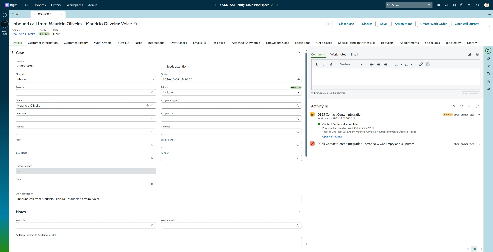
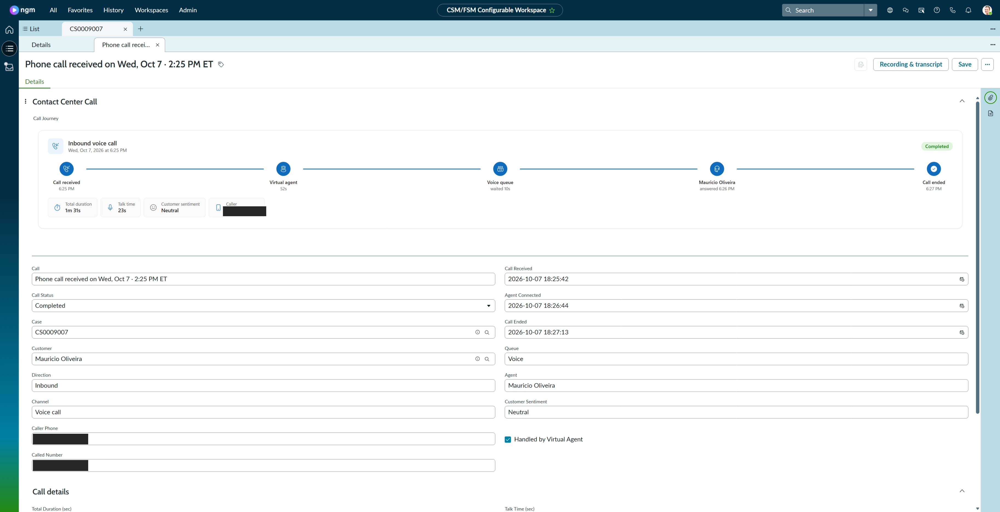
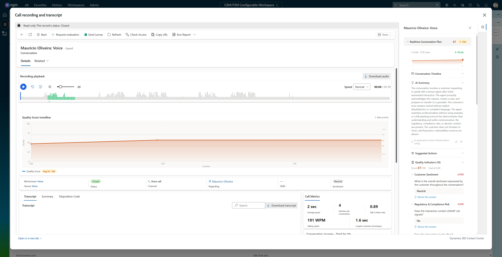
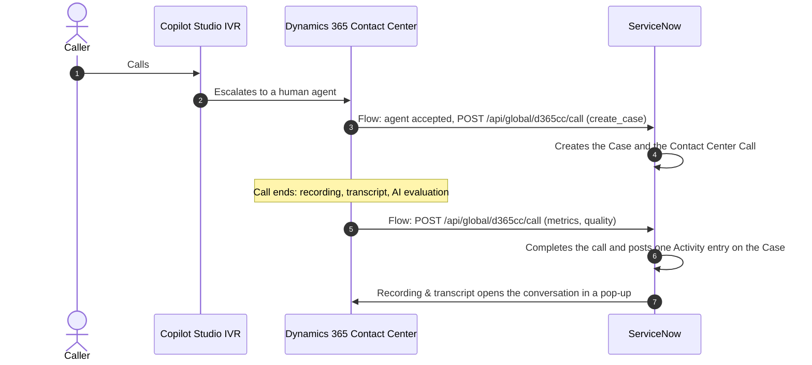
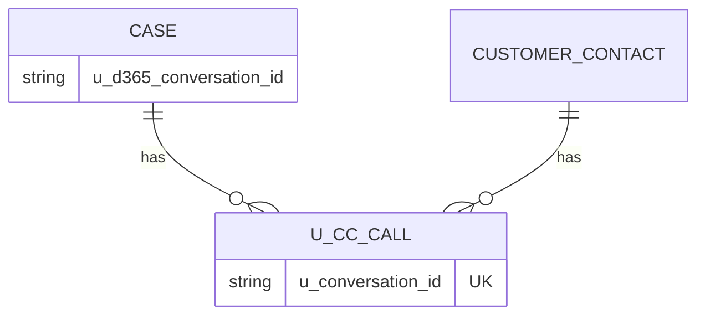

# Dynamics 365 Contact Center × ServiceNow — Call Journey

**Your agents work in ServiceNow. Your calls run on Dynamics 365 Contact Center.**
Every phone call lands on the ServiceNow Case with its full story, and one click opens the Dynamics 365 recording, transcript and AI quality evaluation **inside ServiceNow**.

This is the ServiceNow port of the [Salesforce Call Journey](https://github.com/moliveirapinto/d365-contact-center-salesforce-call-journey). Built and tested on the **CSM/FSM Configurable Workspace** (Zurich).

### 1. The Case: one **Open call journey** button, and a log entry for every call



### 2. The Contact Center Call record: the call journey on top, one **Recording & transcript** button



### 3. Recording & transcript: the Dynamics 365 conversation, full size, inside ServiceNow



---

> **Download the install packages from the [latest release](https://github.com/moliveirapinto/d365-contact-center-servicenow-call-journey/releases/latest)** (ServiceNow update set + Dynamics 365 solution), then follow [Install, step by step](#install-step-by-step), or [let an AI assistant install it for you](#let-an-ai-assistant-install-it-for-you) by pasting one prompt.

---

## Contents

1. [What you get](#what-you-get)
2. [What is in this repository](#what-is-in-this-repository)
3. [Before you start](#before-you-start) (including how to get a free ServiceNow instance and how to install the connector)
4. [Let an AI assistant install it for you](#let-an-ai-assistant-install-it-for-you)
5. [Install, step by step](#install-step-by-step)
   * [Step 1 – ServiceNow: import the update set](#step-1--servicenow-import-the-update-set)
   * [Step 2 – ServiceNow: set your Dynamics 365 address](#step-2--servicenow-set-your-dynamics-365-address)
   * [Step 3 – ServiceNow: create the integration user](#step-3--servicenow-create-the-integration-user)
   * [Step 4 – Dynamics 365: import the solution](#step-4--dynamics-365-import-the-solution)
   * [Step 5 – Dynamics 365: connect and turn the flows on](#step-5--dynamics-365-connect-and-turn-the-flows-on)
   * [Step 6 – Softphone in the ServiceNow Workspace](#step-6--softphone-in-the-servicenow-workspace)
   * [Step 7 – Copilot Studio (optional)](#step-7--copilot-studio-optional)
6. [Test it](#test-it)
7. [Troubleshooting](#troubleshooting)
8. [Alternative: scripted install](#alternative-scripted-install)
9. [How it works](#how-it-works)
10. [Data model](#data-model)
11. [Settings](#settings)
12. [Uninstall](#uninstall)
13. [Notes and limits](#notes-and-limits)

---

## What you get

| Where | What the agent sees |
|---|---|
| **Case header** | One button, **Open call journey**. One call on the Case: it opens that call as a sub tab. Several calls: a **Calls on this case** pop-up lists them (date, time, direction, agent, duration, sentiment, quality score, status) and the one you pick opens as a sub tab. |
| **Case Activity stream** | **One entry per call**, posted when the call completes: *Contact Center call completed* with total and talk time, agent, sentiment and the AI quality score, plus an **Open call journey** link. |
| **Contact Center Call record** | The **Call Journey** card on top (received → virtual agent → queue → agent → ended, with duration, talk time, sentiment and caller), then the call fields. One **Recording & transcript** button in the header. |
| **Recording & transcript** | A large pop-up with the Dynamics 365 conversation: audio player and waveform, transcript, call metrics, quality trendline and the AI evaluation side pane. |
| **Workspace top bar** | The Dynamics 365 Contact Center conversation widget (softphone), through ServiceNow OpenFrame. |
| **Classic UI** | A *Contact Center Calls* related list on the Case and on the Customer Contact. |

Calls reach ServiceNow by themselves: when an agent accepts a voice call in Dynamics 365 a **Case and a call record are created**, and when the call ends the **metrics and the AI quality evaluation** are added.

## What is in this repository

| Folder / file | What it is |
|---|---|
| [`servicenow/package/D365_ContactCenter_CallJourney_ServiceNow_UpdateSet_1.0.2.xml`](servicenow/package) | **ServiceNow update set**, the whole ServiceNow side in one file: table `u_cc_call` and its fields, Case fields, Script Includes, Business Rules, UI Page and Actions, the Case button and call picker, form layouts, related lists, softphone (OpenFrame) configuration, the REST API and the system properties. |
| [`servicenow/package/post-install-fix-script.js`](servicenow/package/post-install-fix-script.js) | Optional repair script (also inside the update set): re-creates the form layout, related lists and softphone, and gives you the softphone role. You do not need it after a normal install. |
| [`dynamics365/D365ContactCenter_ServiceNow_CallJourney_1_0_1_0.zip`](dynamics365) | **Dynamics 365 solution** (unmanaged): the two Power Automate flows, a connection reference and three environment variables for the ServiceNow address and login. No credentials inside. |
| `servicenow/src/`, `deploy/` | Source of everything above and a scripted installer (see [Alternative: scripted install](#alternative-scripted-install)). |
| `docs/images/` | Screenshots used in this README. |

## Before you start

You need:

* A **ServiceNow instance with Customer Service Management** (CSM) and the **CSM/FSM Configurable Workspace**. You must be able to sign in as `admin` (or a user with the `admin` role).
* A **Dynamics 365 Contact Center** environment with voice, and permission to import solutions and run Power Automate flows there.
* The **same Microsoft Entra account** signed in to Dynamics 365 in the agent's browser. The recording pop-up shows Dynamics 365 inside ServiceNow, so the agent must be able to sign in to Dynamics 365 from that browser (allow third-party cookies for `*.dynamics.com` if your browser blocks them).
* These two values, which you will use several times:

  | Value | Example |
  |---|---|
  | ServiceNow instance host name | `dev12345.service-now.com` |
  | Dynamics 365 environment URL | `https://contoso.crm.dynamics.com` |

> **Try it on a non-production instance first.** This is a community sample, not an official Microsoft or ServiceNow product.

### Don't have a ServiceNow instance? Get a free one

ServiceNow has no public trial, but there are two free routes. Both give you an instance you can sign in to as `admin`.

**Option A: Personal Developer Instance (PDI), the standard way**
1. Create a free account at **https://developer.servicenow.com** (**Sign up and start building**) and verify your email.
2. Sign in, accept the Developer Program terms and click **Request an instance**. Choose the **latest release** offered.
3. **Be aware:** at busy times requests are put on a **waitlist** (it can take hours or days) and you get an email when the instance is ready. A PDI is **reclaimed after 10 days of inactivity**, so log in at least once a week. Developer-program instances come with an `admin` login, and the page shows your instance name (for example `dev12345`), URL and password.
4. A PDI does not always include Customer Service Management. In the instance, go to **All → System Applications → All Available Applications → All** and search for **Customer Service** (also called *CSM*) and the **CSM/FSM Configurable Workspace**. If they are not installed, click **Install** and wait until the installation finishes. If you cannot find them there, use Option B.

**Option B: a ServiceNow University lab instance (includes CSM)**
1. Create a free account at **https://learning.servicenow.com** and sign in.
2. Enrol in the free on-demand course **Customer Service Management (CSM) Essentials** (use the latest release version listed).
3. Open the course's **lab** and start the lab instance. ServiceNow gives you the instance address and an `admin` login for it. CSM and the Workspace are already there.
4. **Be aware:** a lab instance is temporary (for example about a week). Install this package right after you get it, and ask for a new one when it expires.

Whichever you choose:
- Note the **instance host name** (for example `dev12345.service-now.com`, or the lab host name) and the `admin` login. You enter the password only in the browser, never in the AI chat.
- Check that it works: open `https://<your host>/now/cwf/agent/home`. You should see the Customer Service Workspace. If it shows *page not found* or no Workspace, CSM or the Configurable Workspace is not active yet.
- Use it for testing only, with no real customer data.
- ServiceNow changes these sign-up pages from time to time. If a link has moved, search for *"ServiceNow Developer Program personal developer instance"*.
---

### Need help installing the ServiceNow connector?

The call journey in this repo assumes the **Dynamics 365 Contact Center panel (the softphone) already opens inside the ServiceNow Workspace**. This is done with ServiceNow **OpenFrame**. If you don't have it yet, an AI assistant can set it up, including the Dynamics 365 side that makes it work. Paste the prompt below into **Claude** (with browser or computer use), **Claude Code**, or a similar agent.

It sets up:

1. **OpenFrame** in ServiceNow (activates the plugin if needed),
2. the **OpenFrame configuration** "Dynamics 365 Contact Center" that points to the Dynamics 365 widget,
3. the **role** `sn_openframe_user` for the people who need the panel,
4. the **Dynamics 365 side**: Contact Center and voice channel, agent licenses and roles, the widget address, and the content security policy that lets ServiceNow show Dynamics 365,
5. a final **check** that the panel loads and signs in.

> ✅ **Nothing to edit.** Paste the prompt exactly as it is. It starts by **asking you** for your ServiceNow instance address, your Dynamics 365 environment URL and who needs the panel. Anything in `<angle brackets>` is filled in by the assistant. You sign in yourself, including MFA, and never type a password into the chat.

````text
You are a ServiceNow and Dynamics 365 installation engineer. Set up the "Dynamics 365 Contact Center" softphone panel in MY ServiceNow instance using ServiceNow OpenFrame, and make sure the Dynamics 365 side is ready for it. Work carefully, change only what is listed, and verify every step.

REFERENCE
- This repository's README (https://raw.githubusercontent.com/moliveirapinto/d365-contact-center-servicenow-call-journey/main/README.md) is context only.
- Microsoft's documentation is the source of truth for the connector. Search Microsoft Learn for "Dynamics 365 Contact Center embed conversation widget ServiceNow OpenFrame" and ServiceNow's documentation for "OpenFrame configuration". If this prompt disagrees with current documentation, follow the documentation, tell me what differs, and continue.
- Values this install uses (tested and working):
  * OpenFrame configuration (table sn_openframe_configuration): Name "Dynamics 365 Contact Center"; Title "Dynamics 365 Contact Center"; Subtitle "Voice and messaging"; URL https://ccaas-embed-prod.azureedge.net/widget/index.html?dynamicsUrl=<MY D365 URL, no trailing slash>; Width 400; Height 700; Order 100; Active true; Default true; Show presence indicator false; Collapsed view enabled false; Enforce sandbox restrictions false.
  * Role to give each user: sn_openframe_user.

HOW TO WORK
- Use the tools you have (browser, shell). If you cannot operate a browser, switch to GUIDE MODE: give me ONE step at a time with exact click paths, wait for me to say "done", and verify what I report before moving on.
- Never guess. If a screen or value differs from this prompt, STOP and tell me exactly what you see.
- Retry a failed action at most twice, then stop and show me the exact error.
- I sign in myself, including MFA. Never ask me to paste passwords or tokens in this chat and never store any. Do your ServiceNow checks inside my signed-in browser session (for example open /api/now/table/... URLs as GET requests, or use the list views).
- Do not delete or change anything that is not listed here. Never touch a different ServiceNow instance or Dynamics 365 environment.
- After each step give a one-line status: OK / WARNING / FAILED.

STEP 0 - QUESTIONS (ask all in one message, then wait)
1. ServiceNow instance host name (for example dev12345.service-now.com). Is it a non-production instance? If production, warn me and continue only after I answer "yes, production".
2. My Dynamics 365 Contact Center environment URL (for example https://contoso.crm.dynamics.com). Use it exactly as given, without a trailing slash and without a path.
3. Which ServiceNow users (user names or e-mails) must see the panel? Which Dynamics 365 agents will use it?
4. Confirm I can sign in as: (a) a ServiceNow administrator (role admin), (b) a Dynamics 365 / Power Platform administrator for the environment above, (c) a Dynamics 365 Contact Center agent (to test the sign-in at the end).
5. Does my instance have Customer Service Management and the CSM/FSM Configurable Workspace (open https://<host>/now/cwf/agent/home)? If you can check it yourself, do so and tell me instead of asking.

STEP 1 - PREFLIGHT (read-only; tell me before changing anything)
1. Sign in to the instance in the browser (I complete it).
2. OpenFrame plugin: All > System Definition > Plugins, search "OpenFrame". Also check that https://<host>/api/now/table/sn_openframe_configuration?sysparm_limit=5 answers with JSON (a "Table not found" or 404 error means OpenFrame is not active) and that the role exists: https://<host>/api/now/table/sys_user_role?sysparm_query=name=sn_openframe_user.
3. Existing configuration: list https://<host>/api/now/table/sn_openframe_configuration?sysparm_fields=sys_id,name,url,active. If a record named "Dynamics 365 Contact Center" already exists (the call journey package of this repo creates the same one), STOP and ask me whether to update it. Never create a second one with the same name.
4. Workspace: https://<host>/now/cwf/agent/home must open the Customer Service Workspace.

STEP 2 - ACTIVATE OPENFRAME (only if STEP 1 showed it inactive)
All > System Applications > All Available Applications > All, or System Definition > Plugins: search "OpenFrame", open it, click Activate/Install and wait until it finishes (it can take several minutes; do not click twice). Ask me to confirm before activating on a production instance. Repeat the checks of STEP 1.2 and report.

STEP 3 - OPENFRAME CONFIGURATION
1. Navigate: All > OpenFrame > Configurations (or type sn_openframe_configuration.list in the filter navigator). Click New.
2. Fill the fields from "Values this install uses" above, with my Dynamics 365 URL in the URL. Keep the name EXACTLY "Dynamics 365 Contact Center" so the call journey package updates this record instead of creating a duplicate. Submit.
3. VERIFY: reload the list; exactly one record with that name, Active true, and the URL ends with dynamicsUrl=<my D365 URL>. Show me the URL.

STEP 4 - ROLE FOR USERS
Give the role sn_openframe_user to every user I named: User Administration > Users > the user > Roles tab > Edit > add the role > Save. VERIFY with https://<host>/api/now/table/sys_user_has_role?sysparm_query=role.name=sn_openframe_user&sysparm_fields=user.user_name and compare to my list.

STEP 5 - DYNAMICS 365 SIDE (the panel only works if this is in place; check each item and report)
Sign-in: ask me to sign in at https://admin.powerplatform.microsoft.com with a Dynamics 365 / Power Platform administrator account, and use the environment I named. Menu names change between releases; if a name differs, search for it and tell me what you found.
1. Contact Center is installed and has a voice channel. Power Platform admin center > Environments > my environment > Resources > Dynamics 365 apps: "Dynamics 365 Contact Center" (and the "Copilot Service admin center" app) must be installed. Open the Copilot Service admin center (the app is listed as "Copilot Service admin center" in the environment's app list) and confirm under Customer support > Workstreams (and Channels) that a workstream of type Voice exists with a phone number or an Azure Communication Services resource. If not, STOP: the connector cannot work without Contact Center and a voice channel, and setting that up is a separate Microsoft guide (Learn: "Set up Dynamics 365 Contact Center"); tell me.
2. Agents. Every person who will use the panel needs (a) a Dynamics 365 Contact Center (or Customer Service Enterprise + Omnichannel) license, (b) a Dynamics 365 user in this environment with the security role "Omnichannel agent" (or "Customer Service Representative"), and (c) membership in a queue/workstream that receives voice calls. Check each user I listed in Step 0 and report what is missing. Do not change roles or licenses without my "yes".
3. Widget address. In the Copilot Service admin center go to Get started > Home, find the tile "Your default contact center" and click Open, then open the "Conversation widget" tab. Under "2. Integration into third-party systems" read the "Embeddable conversation widget URL" (it looks like https://ccaas-embed-prod.azureedge.net/widget/index.html?dynamicsUrl=https://<my org>.crm.dynamics.com). Compare it with the address used in this install (ignore a trailing slash, both work) (https://ccaas-embed-prod.azureedge.net/widget/index.html?dynamicsUrl=<my D365 URL>). If Microsoft's current URL is different, use Microsoft's URL in the OpenFrame configuration URL (STEP 3) and tell me what differs. If the setting does not exist in my environment, tell me and continue with the address above.
4. Allow ServiceNow to frame Dynamics 365 (needed for the Recording & transcript pop-up). Power Platform admin center > Environments > my environment > Settings (the "Environment admin center" settings page) > Product > Privacy + Security > scroll to "Content security policy" and open the "App (model-driven)" tab. If "Enforce content security policy" is Off, nothing is needed: note that and go on. If it is On, the frame-ancestors list must include these entries (keep the existing ones, add only what is missing): https://<my instance host> and https://*.service-now.com (and my custom ServiceNow domain if I use one). Show me the exact list before saving.
5. Browser. The agent signs in to Dynamics 365 inside the panel, in a pop-up. Pop-ups and third-party cookies must be allowed for my ServiceNow host, [*.]dynamics.com, [*.]microsoftonline.com and [*.]azureedge.net (Edge: Settings > Cookies and site permissions; Chrome: Settings > Privacy and security > Third-party cookies > Sites that can always use cookies). If my company manages the browser by policy, tell me to ask IT.
6. Production caution: none of the items above change live calls, but the frame-ancestors change affects who can embed Dynamics 365. Say so and get my "yes" before saving it in a production environment.

STEP 6 - FIRST LOAD AND CHECK
1. Tell me to hard-refresh the Workspace (Ctrl+Shift+R) at https://<host>/now/cwf/agent/home. A softphone/headset icon appears in the top bar.
2. Click it. Expected: a 400 x 700 panel with the Dynamics 365 widget that says it is signing in, and a Microsoft sign-in pop-up. I sign in with my Dynamics 365 agent account. Afterwards the panel shows the agent presence controls.
3. No icon: the user lacks sn_openframe_user (STEP 4), the configuration is not Active (STEP 3), or the page was not refreshed.
4. Panel blank, blocked or "refused to connect": open the browser console. If it says it refused to frame https://ccaas-embed-prod.azureedge.net, ServiceNow's Content Security Policy blocks it: search the filter navigator for "Content Security" / "CSP", find the allow list (frame-src / frame-ancestors) and show me what you would add (https://ccaas-embed-prod.azureedge.net). Wait for my "yes" before changing it. If you cannot find such a setting, STOP and tell me what the console says.
5. Pop-up blocked or sign-in loops: allow pop-ups and third-party cookies as in STEP 5.5, and retry in a normal (not private) window.
6. HTTP 400 "Request Too Long": clear the cookies for dynamics.com and microsoftonline.com and retry.

STEP 7 - FINAL REPORT
Give me a table: item (OpenFrame plugin, configuration, roles, Dynamics 365 side, first load) / status (OK, WARNING, FAILED) / what you saw. List exactly what you changed and how to undo it (deactivate the configuration, remove the role from the users, remove any frame-ancestors/CSP entries you added). Then tell me the next step: install the call journey package from this README ("Let an AI assistant install the call journey for you").

START with STEP 0.
````

### What this prompt cannot do for you

- It cannot sign in for you or accept the Microsoft sign-in pop-up.
- Buying and assigning Dynamics 365 Contact Center licenses and creating the voice channel are done in Microsoft 365 / Dynamics 365; the prompt checks them and tells you what is missing.
- If your company blocks third-party cookies or pop-ups by policy, your IT team has to allow them for the domains listed in STEP 5.


## Let an AI assistant install it for you

This is the third step, after you have a ServiceNow instance and the Dynamics 365 panel works inside it (see the two sections above). Copy the whole prompt below into an AI assistant that can work in a browser and/or run commands (for example **Claude** with computer or browser use, **Claude Code**, or a similar agent). It will ask you a few questions, install both packages, check every step, and report back. If your assistant cannot operate a browser, the prompt switches it to a guided mode where it walks you through each click.

**You stay in control:** you sign in yourself (including MFA), and the assistant stops and asks whenever something is not as expected.

> ✅ **Nothing to edit.** Paste the prompt exactly as it is. The assistant starts by **asking you** for what it needs: your ServiceNow instance address, your Dynamics 365 environment URL, your time zone, and who should see the softphone. Have those ready. Anything in `<angle brackets>` or with an example value (such as `dev12345.service-now.com` or `contoso.crm.dynamics.com`) is filled in by the assistant from your answers. You never type your passwords into the chat: you sign in yourself in the browser, including MFA. The assistant creates the one password the integration needs and keeps it only inside ServiceNow and Power Automate.

````text
You are an installation engineer. Install the community package "Dynamics 365 Contact Center x ServiceNow Call Journey" for me, end to end, carefully and safely.

SOURCE
Repository: https://github.com/moliveirapinto/d365-contact-center-servicenow-call-journey
README (source of truth): https://raw.githubusercontent.com/moliveirapinto/d365-contact-center-servicenow-call-journey/main/README.md
Release v1.0.2 files:
  A) ServiceNow update set: https://github.com/moliveirapinto/d365-contact-center-servicenow-call-journey/releases/download/v1.0.2/D365_ContactCenter_CallJourney_ServiceNow_UpdateSet_1.0.2.xml
  B) Dynamics 365 solution: https://github.com/moliveirapinto/d365-contact-center-servicenow-call-journey/releases/download/v1.0.2/D365ContactCenter_ServiceNow_CallJourney_1_0_1_0.zip
Read the README first. If the README and this prompt disagree, follow the README and tell me. If a newer release exists, use the files the README names and tell me.

HOW TO WORK
- Use the tools you have (browser, shell, file download). If you cannot operate a browser, switch to GUIDE MODE: give me ONE step at a time with exact click paths, wait for me to say "done", and check what I report before moving on. If you cannot open URLs, ask me to paste the README and download the files myself.
- Never guess. If a screen, value or count differs from what this prompt says, STOP and tell me exactly what you see.
- Retry a failed action at most twice. Then stop and show me the exact error.
- Only do what is listed here. Do not delete or change any other record, setting, flow or solution.
- Sign-in: I sign in myself, including MFA. Tell me when you need it, then wait. Do not ask me to paste my own password or tokens into this chat.
- The only secret you create is the password of the ServiceNow integration user. Generate it (24+ characters, letters, digits and symbols, no quotes or backslashes), use it only in the two places named below, and never write it to a file, log, screenshot, commit or message. At the end tell me where it lives.
- After each phase give me one or two lines of status (OK / WARNING / FAILED) before you continue.

PHASE 0 - QUESTIONS (ask all in one message, then wait)
1. ServiceNow instance host name, for example dev12345.service-now.com.
2. Is this a non-production instance? If it is production, warn me and continue only after I answer an explicit "yes, production".
3. Dynamics 365 Contact Center environment URL (for example https://contoso.crm.dynamics.com) and the environment's name as shown in Power Apps.
4. Optional: the Dynamics 365 Contact Center app id (leave blank if I do not know it).
5. Time zone (IANA name, for example America/New_York) and a short label (for example ET) for call titles.
6. Besides me, which ServiceNow users should see the softphone (user names or e-mails)? "None" is fine.
7. Confirm I can sign in to: (a) ServiceNow as an admin, (b) Power Apps with an account that can import solutions and create connections in that environment.

PHASE 1 - PREFLIGHT
1. Download files A and B. Check A is well-formed XML containing 182 sys_update_xml elements, and B is a valid zip containing solution.xml, customizations.xml and exactly two .json files under Workflows/. Expected sizes: A 552,684 bytes, B 8,394 bytes (they differ only if the README names newer files).
2. Ask me to sign in to ServiceNow as an admin. Confirm the table sn_customerservice_case exists (Customer Service Management is installed) and the "CSM/FSM Configurable Workspace" is available. If either is missing, STOP: this package needs it.

PHASE 2 - SERVICENOW PACKAGE
1. System Update Sets > Retrieved Update Sets > "Import Update Set from XML" > upload file A.
2. Open "D365 Contact Center - Call Journey 1.0.2". State must be Loaded and it must list 182 update records.
3. Click "Preview Update Set" and wait until the state is Previewed. There must be 0 problems. If there is any problem, STOP and show it to me. Do not accept or skip problems.
4. Click "Commit Update Set" and wait until the state is Committed.
5. Verify, and report each item: table u_cc_call exists; Script Includes D365CCJourney, D365CCUtil, D365CCPlay and D365CCIcons exist; Scripted REST API "D365 Contact Center" is active with POST /api/global/d365cc/call; OpenFrame configuration "Dynamics 365 Contact Center" exists; UI Action "Open call journey" exists on sn_customerservice_case; UI Action "Recording & transcript" exists on u_cc_call; four Business Rules whose names start with "D365CC" exist.

PHASE 3 - SETTINGS
Set these System Properties (sys_properties.list): d365cc.org_url = my Dynamics 365 URL with no trailing slash; d365cc.app_id = the app id if I gave one; d365cc.time_zone; d365cc.time_zone_label. Then check the OpenFrame configuration "Dynamics 365 Contact Center" has a URL ending in dynamicsUrl=<my Dynamics 365 URL>. (It updates itself when d365cc.org_url is saved. If it did not, STOP and tell me.)

PHASE 4 - INTEGRATION USER
1. Create a ServiceNow user: User ID d365cc.integration, Active, "Web service access only" ticked.
2. Give it the role sn_customerservice_agent.
3. Generate the password and set it INSIDE ServiceNow with the "Set Password" action on the user form (or a server-side script). NEVER set it through the Table API or REST: that stores it in clear text and sign-in then fails.
4. Verify by calling GET https://<instance>/api/now/table/u_cc_call?sysparm_limit=1 with Basic authentication as d365cc.integration. Expect HTTP 200. HTTP 401 means the password was not set correctly: set it again through the form. HTTP 403 means the role is missing.
5. Check the Dynamics 365 endpoint the same way, with an EMPTY body so nothing is created: POST https://<instance>/api/global/d365cc/call with Basic authentication as d365cc.integration, header Content-Type: application/json and body {}. Expect HTTP 400 with the message "conversation_id is required". That proves the endpoint is live and the user may call it. HTTP 401, 403 or 404 means something is wrong: STOP and tell me. Never send a body that contains a conversation_id; that would create a Case and a call record.

PHASE 5 - DYNAMICS 365
1. Open https://make.powerapps.com, ask me to sign in, and select the environment I named. Confirm it is the Contact Center environment: it must have the table "Conversation" (logical name msdyn_ocliveworkitem). If not, STOP.
   Also check the content security policy that lets ServiceNow show Dynamics 365 in the Recording & transcript pop-up: Power Platform admin center > Environments > my environment > Settings > Product > Privacy + Security > Content security policy > "App (model-driven)" tab. If "Enforce content security policy" is On, the frame-ancestors list must allow https://<my instance host> (or https://*.service-now.com). Show me the list and ask before adding it. If enforcement is Off, nothing is needed. The panel itself (softphone) is covered by the section "Need help installing the ServiceNow connector?"; if the softphone icon does not open, use that prompt first.
2. Solutions > Import solution > upload file B > Next.
3. On the connections page, create or select a Microsoft Dataverse connection for "D365 Contact Center - Dataverse" (I sign in if asked).
4. Fill the three environment variables: "ServiceNow Instance" = the host name only (no https://); "ServiceNow User" = d365cc.integration; "ServiceNow Password" = the generated password.
5. Import and wait for the success message.
6. Open the solution "D365 Contact Center - ServiceNow Call Journey". Check that the connection reference "D365 Contact Center - Dataverse" is connected. Turn ON both flows: "D365 Contact Center - Create ServiceNow case when an agent accepts a call" and "D365 Contact Center - Sync ended calls to ServiceNow". Reload the page and confirm both show On. If a flow asks to fix its connection, fix it and turn it on again.
7. Confirm all three environment variables have a current value. For the password only confirm it is not empty; never display it.

PHASE 6 - SOFTPHONE ACCESS
Give the role sn_openframe_user to me and to the users I listed. Verify each assignment. Tell them to hard-refresh the CSM/FSM Configurable Workspace; the Dynamics 365 softphone icon then appears in the top bar.

PHASE 7 - END-TO-END CHECK
Ask me to place a real call to my Dynamics 365 voice number, accept it as an agent, then end it. Do not create fake data. Then check, read-only:
- Within about two minutes of the agent accepting: a new Case exists in sn_customerservice_case and a row exists in u_cc_call related to it.
- After the call ends: the u_cc_call status is Completed and the Case Activity stream shows one entry "Contact Center call completed".
- In the Workspace: the Case button "Open call journey" opens the call as a sub tab with the Call Journey card on top, and "Recording & transcript" on the call opens the recording and transcript pop-up.
If something is missing, use the Troubleshooting table in the README. Look first at the flow run history in Power Automate, then at the ServiceNow System Log (messages starting with "[D365CC]"). Report what you find; do not change anything else without asking me.

STOP AND ASK ME WHENEVER
- a check in this prompt fails or a count does not match,
- you are asked to sign in, approve MFA, accept terms or pay for anything,
- the target looks like production and I have not said "yes, production",
- you would have to do something that is not in this prompt.

FINAL REPORT
Give me a table with every phase and its result, then: (1) anything I still have to do by hand, (2) where the integration password is stored (the ServiceNow user record and the Dynamics 365 environment variable "ServiceNow Password") and how to rotate it (set a new password on the user in ServiceNow, then update the environment variable and turn the flows off and on), (3) the link to the README Troubleshooting section, (4) a reminder that this is a community sample, not an official Microsoft or ServiceNow product.
````
## Install, step by step

### Step 1 – ServiceNow: import the update set

1. Download [`D365_ContactCenter_CallJourney_ServiceNow_UpdateSet_1.0.2.xml`](servicenow/package/D365_ContactCenter_CallJourney_ServiceNow_UpdateSet_1.0.2.xml) (use the **Download raw file** button on GitHub).
2. In ServiceNow open **System Update Sets → Retrieved Update Sets** and click **Import Update Set from XML**.
3. Choose the file and click **Upload**. The update set **D365 Contact Center - Call Journey 1.0.2** appears with state *Loaded*.
4. Open it and click **Preview Update Set**. Wait until the state is *Previewed*. There should be **0 problems**.
5. Click **Commit Update Set**.

### Step 2 – ServiceNow: set your Dynamics 365 address

Everything else (table, buttons, form layout, related lists, softphone) arrived with the update set. You only tell it where your Dynamics 365 is.

In **System Properties** (type `sys_properties.list` in the navigator) set:

| Property | Value |
|---|---|
| `d365cc.org_url` | Your Dynamics 365 URL, for example `https://contoso.crm.dynamics.com` |
| `d365cc.app_id` | *(optional)* The id of the Contact Center app in your environment |
| `d365cc.time_zone` | IANA time zone used in call titles, for example `America/New_York` |
| `d365cc.time_zone_label` | Short label shown in call titles, for example `ET` |

Saving `d365cc.org_url` also points the **softphone** (OpenFrame configuration *Dynamics 365 Contact Center*) at your environment, automatically.

> If something looks incomplete, you can run the optional repair script: **System Definition → Fix Scripts → D365CC - Post-install configuration → Run Fix Script**. It is safe to run any number of times.

### Step 3 – ServiceNow: create the integration user

Dynamics 365 uses this user to send calls to ServiceNow.

1. **User Administration → Users → New**. User ID `d365cc.integration`, tick **Web service access only**.
2. Give it the role **`sn_customerservice_agent`**.
3. **Set the password inside ServiceNow** (the *Set Password* UI action or a background script). Do not set it through the Table API: that stores it in clear text and sign-in then fails.
4. Keep the user ID and password: you need them in step 5.

### Step 4 – Dynamics 365: import the solution

1. Go to <https://make.powerapps.com>, pick your **Dynamics 365 Contact Center environment**, then **Solutions → Import solution**.
2. Choose [`D365ContactCenter_ServiceNow_CallJourney_1_0_1_0.zip`](dynamics365/D365ContactCenter_ServiceNow_CallJourney_1_0_1_0.zip) and click **Next**.
3. On the connections page, **create or choose a Microsoft Dataverse connection** for *D365 Contact Center - Dataverse*, and fill the three environment variables:

   | Variable | Value |
   |---|---|
   | **ServiceNow Instance** | Host name only, for example `dev12345.service-now.com` |
   | **ServiceNow User** | `d365cc.integration` (the user from step 3) |
   | **ServiceNow Password** | The password of that user |

4. Click **Import** and wait for the *success* message.

The solution contains two flows:

| Flow | Does |
|---|---|
| **D365 Contact Center - Create ServiceNow case when an agent accepts a call** | Every minute, finds voice calls an agent has accepted and sends them to ServiceNow, which creates the **Case and the call record** (it looks up the customer by phone, e-mail or name, or creates one). |
| **D365 Contact Center - Sync ended calls to ServiceNow** | When a voice conversation ends, sends the **timings, sentiment and AI quality evaluation** to ServiceNow. |

> The password is stored as a plain environment variable. For production move it to **Azure Key Vault** (a secret environment variable).

### Step 5 – Dynamics 365: connect and turn the flows on

1. In **Solutions → D365 Contact Center - ServiceNow Call Journey** open **Connection references**, open *D365 Contact Center - Dataverse* and select your connection if it is not set.
2. Open each of the two flows and click **Turn on**. A flow that is off, or has no connection, does nothing.
3. The account that owns the connection must be able to **read voice conversations, contacts and evaluation history** in the environment.

### Step 6 – Softphone in the ServiceNow Workspace

The update set created the OpenFrame configuration **Dynamics 365 Contact Center** and step 2 pointed it at your environment. Give every agent who should see the softphone:

1. The role **`sn_openframe_user`** (User Administration → Users → the user → Roles).
2. *(Optional)* In the Copilot Service admin center → *your default contact center* → **Conversation widget**, copy the **Embeddable conversation widget URL** and paste it in **OpenFrame → Configurations → Dynamics 365 Contact Center → URL**. The default URL is built from `d365cc.org_url`.

The softphone icon then appears in the top bar of the Workspace.

### Step 7 – Copilot Studio (optional)

If your IVR runs in Copilot Studio and creates the Case itself, write the conversation id into the ServiceNow Case so the call is linked instead of duplicated:

* Use the ServiceNow connector → **Create record** on table `sn_customerservice_case`.
* Map the field **`u_d365_conversation_id`** to `Global.msdyn_ConversationId`.

If you skip this, the accept flow creates the Case for you.

---

## Test it

1. Place a call to your Dynamics 365 voice number and let an agent accept it, then end the call.
2. Within about a minute of the agent accepting, a **Case** appears in ServiceNow with a **Contact Center Call** related to it.
3. When the call ends, the Case **Activity** shows **Contact Center call completed**.
4. On the Case click **Open call journey**: the call opens as a sub tab with the Call Journey card on top.
5. On the call click **Recording & transcript**: the Dynamics 365 recording, transcript and evaluation open in a full-size pop-up.

To send a past call again without placing a new one, use the [replay script](#alternative-scripted-install) (`deploy/d365/replay-sync.mjs`).

## Troubleshooting

| Symptom | Cause and fix |
|---|---|
| Nothing arrives in ServiceNow | Check that **both flows are on** and their connection is set. Open the flow's **Run history** in Power Automate. |
| Flow run fails with **401** | The integration user's password was set through the Table API, or the environment variables are wrong. Set the password again inside ServiceNow and re-check the three variables. |
| Flow run fails with **403** | The integration user lacks the role `sn_customerservice_agent`. |
| No **Open call journey** button on the Case | Reload the Workspace (hard refresh). The button shows on Cases in the CSM/FSM Configurable Workspace. |
| Click **Open call journey** and nothing opens | The call record was deleted, or the Workspace tab was reloaded just before. Reload the Case and try again. |
| The Activity link opens a tab that closes by itself | By design: ServiceNow does not let the Activity stream run scripts, so a short hand-off page asks the Workspace to open the call as a sub tab. The **Open call journey** button on the Case does not do this. |
| **Recording & transcript** pop-up stays blank or asks to sign in | Sign in to Dynamics 365 in the same browser, and allow third-party cookies for `*.dynamics.com`. Check `d365cc.org_url` has no trailing text. |
| No softphone icon | The user needs the role `sn_openframe_user`; check **OpenFrame → Configurations** that *Dynamics 365 Contact Center* is active and `d365cc.org_url` is set. |
| Call record form is missing the journey card or the related lists | Run the optional repair script (see step 2). |
| Dynamics 365 widget keeps crashing in the browser | Very large numbers of unread notifications in Dynamics 365 can exhaust the browser: delete old `appnotification` records. |

## Alternative: scripted install

If you prefer scripts to the packages (or want to change the code), requires **Node 18+**:

```powershell
copy .env.example .env.local     # fill in your instance, admin login and Dynamics 365 URL
node deploy/deploy.mjs           # schema, logic, UI, softphone, REST API, call picker, open-call hand-off
```

| Step | Script | Does |
|---|---|---|
| 1 | `deploy/steps/01-schema.mjs` | Table, columns, choices, Case fields, `d365cc.*` settings |
| 2 | `deploy/steps/02-logic.mjs` | Script Includes, Business Rules, calculated fields |
| 3 | `deploy/steps/03-ui.mjs` | UI Page, UI Actions, form layouts (classic + Workspace) |
| 4 | `deploy/steps/04-security.mjs` | OpenFrame (Dynamics 365 widget) |
| 5 | `deploy/steps/05-rest.mjs` | Scripted REST API for the Dynamics 365 flows |
| 6 | `deploy/steps/06-play.mjs` | Call picker and the Case button |
| 7 | `deploy/steps/07-open.mjs` | Open-call hand-off for the Activity link |

All steps are idempotent. Run a subset with `node deploy/deploy.mjs 03-ui`.

Dynamics 365 flows from scripts (needs a Dataverse token in `D365_TOKEN` and the integration password in `SN_INTEGRATION_PASS`):

```powershell
node deploy/d365/create-accept-flow.mjs     # create the Case when an agent accepts
node deploy/d365/create-flow.mjs            # sync metrics when the call ends
node deploy/d365/replay-sync.mjs <conversationId>   # replay one past call
```

## How it works



The REST call is an **upsert** keyed on the Dynamics 365 conversation id, so it does not matter which event arrives first: you always end up with exactly one call record per call.

### Feature parity with the Salesforce version

| Salesforce | ServiceNow (this repo) |
|---|---|
| `Contact_Center_Call__c` object | Table **`u_cc_call`** ("Contact Center Call"), same fields |
| Case fields `D365_Conversation_Id__c`, `D365_Call_Recording__c` | `sn_customerservice_case.u_d365_conversation_id`, `u_d365_call_recording`, `u_call_journey` |
| Custom Setting *D365 Contact Center Settings* | System properties `d365cc.*` |
| Flow *Create Call from IVR case* | Business Rule **D365CC – Create call from IVR case** |
| `callTimeline` LWC | Script Include **`D365CCJourney`**, rendered in the Call Journey field |
| `callRecordingModal` LWC | UI Page **`d365cc_recording`** + UI Action **Recording & transcript** |
| D365 sync flow → Salesforce REST | Scripted REST **`POST /api/global/d365cc/call`** + the two Power Automate flows |
| D365 CTI widget in the Salesforce console | **OpenFrame** configuration |

## Data model

One **Case** has many **calls**. Each call is its own row in `u_cc_call`, related to the Case (`u_case`) and the customer (`u_contact`).



* `u_conversation_id` is unique per call and is the key the flows upsert on.
* `sn_customerservice_case.u_d365_conversation_id` holds the conversation the IVR stamped on the Case; further calls link to the Case by being related to it.
* The AI quality evaluation (score, plan, summary, coaching, details) is stored on the call. The score and band show on the Case Activity entry and in the call picker; the full evaluation is in the Dynamics 365 pop-up.

## Settings

| Property | Meaning |
|---|---|
| `d365cc.org_url` | Dynamics 365 environment URL |
| `d365cc.app_id` | Contact Center app id (optional) |
| `d365cc.time_zone` | IANA time zone used in call titles |
| `d365cc.time_zone_label` | Short label in call titles (for example `ET`) |

Times inside the Call Journey card and the call picker are shown in each agent's own ServiceNow time zone.

## Uninstall

* **Dynamics 365:** turn the two flows off and delete the solution *D365 Contact Center - ServiceNow Call Journey*.
* **ServiceNow:** deactivate the Business Rules *D365CC – …*, the OpenFrame configuration and the Scripted REST API *D365 Contact Center*. The table `u_cc_call` and its data can stay; delete it only if you do not need the call history.

## Notes and limits

* **Short calls (fixed in 1.0.2).** Earlier versions missed calls that ended within about a minute, because the accept flow only looked at calls still open when it ran, so no Case was created. From 1.0.2 the flow also looks at ended calls from the last 30 minutes, and the ServiceNow service gives a call that was synced first its Case. If you installed an earlier version, import the new update set and solution (see Step 1 and Step 4).

* **Widget version: classic embeddable widget (default) or the new Contact Center Edge desktop (tested 2026-10-08).** By default this package installs the classic widget (`ccaas-embed-prod.azureedge.net`) in OpenFrame. To use the new Edge desktop (the one the [Salesforce version](https://github.com/moliveirapinto/d365-contact-center-salesforce-call-journey) uses), deploy with `D365_WIDGET=edge`:

  ```powershell
  $env:D365_WIDGET='edge'; node deploy/deploy.mjs 04-security 08-edge
  ```

  Pointing OpenFrame straight at the Edge portal does **not** work: the portal shows *Application Failed to Load*, because in embedded mode it waits for its host to answer a `d365edge:ping` with a `d365edge:init` message (in Salesforce, Microsoft's `d365EdgeContainer` component does that). Step `08-edge` adds a small ServiceNow page, `/d365cc_edge.do` (UI page `d365cc_edge` + UI script `d365cc_edge_host`), that frames the portal and speaks that protocol; OpenFrame then shows that page as a 480 x 700 px side panel (Microsoft's recommended Edge panel width), so the ServiceNow record stays visible; Edge shows one pane at a time and the inbox toggle switches to the list. Change Width/Height in OpenFrame > Configurations if needed. It reads the org from `d365cc.org_url`; optional properties `d365cc.edge_url` (regional portal, default `https://portal.us.contactcenterai.powerplatform.com/experience/agent`) and `d365cc.edge_layout` (`compact` default: header with outbound call, presence and Copilot; `embedded` hides the header). Copilot is tied to a conversation: with no active conversation, both the **Open Copilot** button and the header Copilot icon do nothing, also in Microsoft's own portal outside any CRM (preview behavior, checked 2026-10-08); test it during a call. Screen pop opens the matching ServiceNow contact/account (by phone, e-mail, then name) in the Workspace; an incoming conversation opens the panel. After switching, go to `https://<host>/cache.do` once and hard-refresh the Workspace, otherwise the old panel stays cached. The agent signs in with Microsoft in a pop-up the first time. No package or `04t` link is needed on ServiceNow. Switch back with `node deploy/deploy.mjs 04-security` (without `D365_WIDGET`). Everything else in this package (calls, Cases, the journey card, the recording view) is filled in by the Dynamics 365 flows and the Scripted REST API, so it works with either widget.

* **Icons.** The card uses  [Fluent System Icons](https://github.com/microsoft/fluentui-system-icons) (MIT), embedded inline so they survive ServiceNow's rich-text sanitizer. Regenerate with `node deploy/tools/fetch-icons.mjs`.
* **Case tab strip.** The Workspace tab strip (SLAs, Tasks, Emails…) is configured in UI Builder, not by related-list records, so a *Contact Center Calls* tab has to be added there by hand if you want one. The Case **Open call journey** button already reaches every call.
* **Activity entry icon.** ServiceNow picks the yellow lock icon for work notes; it cannot be changed from here.
* **Secrets.** The flows read the ServiceNow login from environment variables. Use Key Vault for production.
* **Lab instances** from ServiceNow University expire and cannot be shared; a Personal Developer Instance lasts longer. Import the update set again on the new instance.
* This is a community sample, not an official Microsoft or ServiceNow product, and is not supported by either company.
